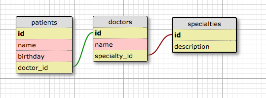

# Doctor's Office
Version 0.0.0: October 7, 2016

by [Karen Freeman-Smith](https://github.com/karenfreemansmith) and [Sara Jensen](https://github.com/thejensen)

## Description
A program to manage a doctor's Office

### User Stories
* As an administrator, I want to add a doctor to the database with a name and specialty.
* As an administrator, I want to add a patient with their name and birthdate.
* As an administrator, I want to be able to assign a patient to a doctor for care.
* As a doctor, I need to see the list of patients that have been assigned to me.

#### Database Diagram

### Specifications
| Behavior                                       | Input                                                   | Output                           |
|------------------------------------------------|---------------------------------------------------------|----------------------------------|
| Add a doctor                                   | Dr. Carter, General Practitioner; Dr. Zed, Pediatrician | Dr. Carter, General Practitioner |
| Add a patient                                  | Joe Smith, 10-19-1975; Sue Smith, 1-12-93               | Joe Smith, 10-19-1975            |
| Assign patient to doctor                       | Dr. Carter, Joe Smith; Dr. Zed, Sue Smith               | Dr. Carter, Joe Smith            |
| View patient list by doctor                    | Dr. Carter                                              | Joe Smith (and others)           |
| View doctor list by specialty                  | General Practitioner                                    | Dr. Carter                       |
| View doctors alphabetically with patient count | N/A                                                     | Dr. Carter (1), Dr. Zed (1)      |

## Setup/Installation
* Clone directory
* Type 'gradle run' inside the directory
* Navigate to 'http://localhost:5467'

## Support & Contact
For questions, concerns, or suggestions please email karenfreemansmith@gmail.com

## Known Issues
* N/A

## Technologies Used
Java, JUnit, Spark, Gradle, Postgres

## Legal
*Licensed under the GNU General Public License v3.0*

Copyright (c) 2016 Copyright _Karen Freeman-Smith & Sara Jensen_ All Rights Reserved.
